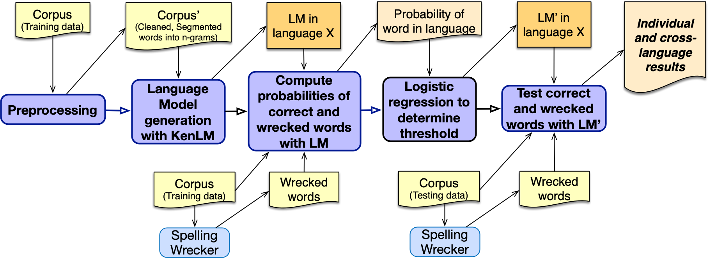

# Description

Automated spellchecking is a core language technology, yet open-source code and models for Nguni languages are often hard to find. This repository provides spellchecking pipelines and associated datasets for Nguni languages (note: some datasets have been excluded due to GitHub's file size limits). These pipelines were created to investigate whether reusing a language model in one language for spellchecking in another may be feasible as a bootstrapping option.

# Citation

Mahlaza, Z., Keet, C.M., Magwenzi, T. On the ability to bootstrap spellcheckers for Nguni languages via reusable model pipelines. Annual Conference of the South African Institute of Computer Scientists and Information Technologists (SAICSIT'26). Springer CCIS (accepted). Cape Town, 13-15 July, 2026. 
